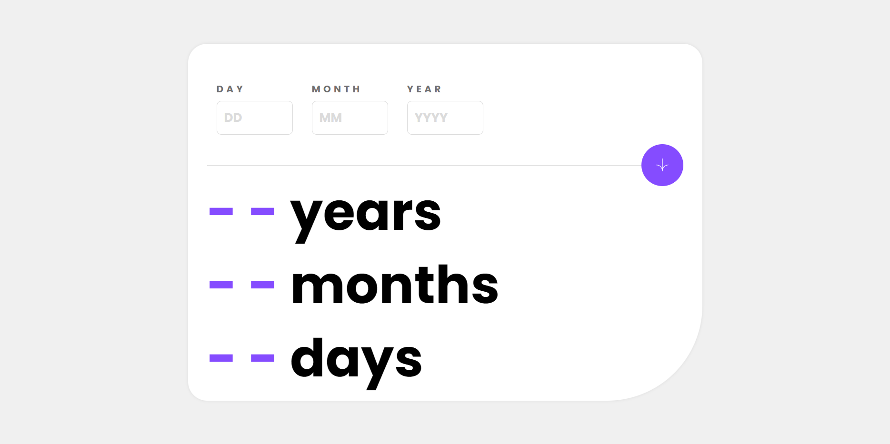

# Frontend Mentor - Age calculator app solution

This is a solution to the [Age calculator app challenge on Frontend Mentor](https://www.frontendmentor.io/challenges/age-calculator-app-dF9DFFpj-Q). Frontend Mentor challenges help you improve your coding skills by building realistic projects. 

## Table of contents

- [Overview](#overview)
  - [The challenge](#the-challenge)
  - [Screenshot](#screenshot)
  - [Links](#links)
- [My process](#my-process)
  - [Built with](#built-with)
  - [What I learned](#what-i-learned)
  - [Continued development](#continued-development)
  - [Useful resources](#useful-resources)
- [Author](#author)
- [Acknowledgments](#acknowledgments)

## Overview

### The challenge

Users should be able to:

- View an age in years, months, and days after submitting a valid date through the form
- Receive validation errors if:
  - Any field is empty when the form is submitted
  - The day number is not between 1-31
  - The month number is not between 1-12
  - The year is in the future
  - The date is invalid e.g. 31/04/1991 (there are 30 days in April)
- View the optimal layout for the interface depending on their device's screen size
- See hover and focus states for all interactive elements on the page

### Screenshot



### Links

- Solution URL: [https://github.com/victor247k/AgeCalculator]
- Live Site URL: [https://victor247k.github.io/AgeCalculator/]

## My process

### Built with

- Semantic HTML5 markup
- CSS custom properties
- Flexbox
- CSS Grid
- Mobile-first workflow
- Javascript

### What I learned

I have learned/ remembered how to add an icon to a website, the clamp property in css, and how to use dates in javascript. Also praciced styling and the mobile-first workflow.

```html
<link rel="icon" type="image/png" sizes="32x32" href="./assets/images/favicon-32x32.png">
```
```css
.text {
  font-size: clamp(3rem, 10vw , 5.5rem);
}
```
```js
const date = new Date();
let year = date.getFullYear();
let month = date.getMonth() + 1;
let day = date.getDate();

function isValidDate(dateString) {
    let date = new Date(dateString);
    return date instanceof Date && !isNaN(date);
} 
// year-month-day
isValidDate(year-month-day)
```

### Continued development

I need to develop the good practices in html css and js.

### Useful resources

- [Example resource 1](https://chat.openai.com) - This helped me with understanding dates on js and helped m fix my code.

## Author

- Instagram - [victorspinei247](https://www.instagram.com/victorspinei247/)
- Frontend Mentor - [@victor247k](https://www.frontendmentor.io/profile/victor247k)
- GitHub - [@victor247k](https://github.com/victor247k)

## Acknowledgments

I am thankful for AI and for this challenge by FrontEnd Mentor
